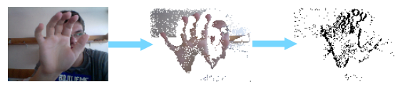
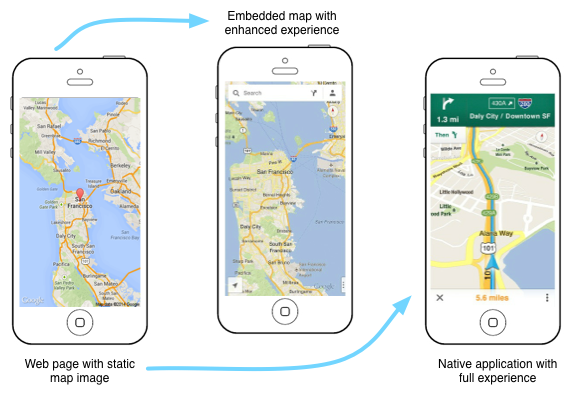

# Beyond Adaptive Web Design

**Ján Antala**

*Slovak University of Technology in Bratislava* 
*Faculty of Informatics and Information Technologies* 
*Ilkovičova 2, 842 16 Bratislava, Slovakia* 
*hello@janantala.com*

Master study programme in field: Information Systems 
Supervisor: Assoc. Professor Michal Čerňanský, Institute of Applied Informatics, Faculty of Informatics and Information Technologies STU in Bratislava

## Abstract

> Mobile device penetration grows rapidly and it brings not only different display sizes with new human interaction methods, but also high-latency networks. But there are not just smartphones and desktop computers. We now have Web-enabled smartphones, tablets, e-readers, netbooks, watches, TVs, phablets, notebooks, game consoles, cars and more. So it is necessary to adapt web pages for different devices and new interaction methods. Several new methods for designing web are rapidly evolving. We present a new way of web components adaptation based on a device features and external conditions in our work and new possibilities of interaction with web application based on speech recognition, motion or device rotation.

## Introduction

The Web is continually evolving and we need to evolve with it. It used to be easier to manage browsers when there were just a few of them on the desktop. Today we not only have to deal with a wide range of desktop browsers but mobile devices, tablets, televisions, weareable devices and more. Even for the average web site things have changed a lot over four years: browser share, operating systems, screen resolutions, and more [[7](#references)].

The basic approach how to provide an optimal viewing experience is to use *Responsive web design* which comes with fluid grids, flexible images and CSS3 media queries [[9](#references)]. While creating flexible layouts is important, there's a lot more that requires remarkable adaptive web experiences. The principles of Adaptive Design are: ubiquity, flexibility, performance, enhancement and future-friendliness [[4](#references)].

The power of the web is its ubiquity. No one knows what the landscape is going to appear in a couple years, but there's a reasoneable probability the new devices in a few years from now will have access to the web. Because of this, we need to preserve and embrace the web's ubiquity. This requires us to provide full web experiences regardless of how and where people access the web. It's important to remain in creating flexible interfaces that can adapt to any screen size. Performance is often less important to everything else. *Progressive enhancement*, feature detection and many other techniques allow us to increase experience that allow us to support more devices while still optimizing for the finest. The key aspect of *Future Friendly* thinking is to acknowledge and embrace unpredictability. Nobody knows where things are going but the one thing we can trust is the evolution.

Adaptive web design is fundamentally progressive enhancement, but it's being applied to a much larger and more diverse landscape. We now have Web-enabled smartphones, tablets, e-readers, netbooks, watches, TVs, phablets, notebooks, game consoles, cars and more. We also have many types of internet networks with different speed, latency and quality. Responsive design is also one technique in an adaptive web design strategy. Creating flexible layouts is important, but there are many more factors we need to think about. It's also important to consider as well ergonomics, touch capability, other input methods, internet connections and many other features that can be detected.

We consider *adaptive web design* as an equal with creating a single Web experience that adjusts based on the capabilities of the device and browser. Website can access sensors in devices and use them to enhance user experience.

## Adaptive Input methods

As we have many types of devices with web access we also have to adapt input methods for them. It is not just about screen sizes, but many displays also have touch capabilities, are equiped with microphone, accelerometer, gyroscope or camera.

Web browsers on TVs are actually really good but the input is terrible so no one uses them. Input is much more important to interface design than screen size. The input defines what a design needs to do in order to accomplish a task [[6](#references)]. We also have wearable computers. The current Google Glass interface is limited to a floating display above head. We don't have full range of motion and, as a result, no spatial cues or depth in the interface. 

There is no one true input for the Web. We have to contend with fingers, mice, keyboards, voice and more. The challenge for us over the next few years is not designing for one input but many.

### Touch

Touch is no longer just isolated to smartphones and tablets. Many big sreens in laptops or desktops nowadays are touch capable. Every desktop design has to be touch-friendly now.

The optimal touch target size is 7mm, based on the average size of human finger tips and pads. CSS2.1 defines a pixel as 1/96 of an inch. So 7mm should be 30pixels [[3](#references)]. However, things aren't so easy because of dynamic viewports. It means that input elemtents in website have to be usually bigger.

The best touch interface is sometimes no touch at all. We can use sensors and speech input which is the next frontier for interaction design.

### Speech

The speech input aims to provide an alternative input method for web applications, without using a keyboard or other physical device. This is no longer science fiction but reality. Many companies rely on it and deploy it to the modern devices and software. It could be also benefitial for older or disabled users [[1](#references)] and can easily become the next big thing.

We can now use speech recognition to take a full control of the web site as we have access to continuous recognition stream. We don't need another input methods at all. A speech feedback for user interaction is also important and we can use speech synthesis feature for it.

### Device motion

We can use a lot of sensors in the devices to detect the device motion. It is made possible by a combination of always-on sensors as are an accelerometer a gyroscope, and a magnetometer, that tell us a lot about how a device is moving through the space around it. The ability of these sensors to provide precise information about the movement of a device opens up new design possibilities for web applications [[12](#references)].

From controlling the user interface based on three dimensional motion as input, to combining device motion with another sensors as are location detection or video cameras [[8](#references)]. There's a lot of interesting interface designs made possible by Device Motion. It depends on us how we use them.

### Video Motion

Many modern devices contains built in video camera sensor which we can use as alternative method to device motion. We can access video stream and analyse landscape around the device. Video motion detection is a way of defining user activity in a scene by analyzing image data and differences in a series of images.

We can detect user motion and use it as an alternatove part of input method. We can build web games and another real time interfaces. There's again a lot of interesting interface designs made possible.

## Adaptive Web Components

One of the most common critiques against responsive Web design is that Web sites have large file size and so they are slowing Web pages down. But we can make responsive sites perform well, we just have to the work to make it possible [[10](#references)].

We all should be interested in page speed and mobile performance because people need fast experiences on the Web. There's lot of studies that highlight the importance of speed. More than half of people with a bad loading experience on mobile, won't come back [[5](#references)]. 73% of mobile internet users say they've encountered Web pages that are too slow, a 1 second delay can result in a 7% reduction in conversions [[11](#references)]. Speed is an esencial part of our strategy and we should care about it. We can quantify its impact on the metrics and track it.

There are many different types of internet connections. Mobile network speeds have rose but this doesn't help much as page load times are still high as bandwidth increases. Latency is a much bigger fragment to download times. LTE reduces tower latency by several milliseconds but we still need to make a number of connections to download data to our devices [[5](#references)].

So what we should do about it? We can create reuseable components and conditionaly load resources. Web components allow us to use custom HTML elements in the browser. We can enclose a simple element or an entire application logic within an HTML element [[2](#references)]. We can build Web applications in a reusable, commutable and encapuslated way.

## Evaluation and experiments 

We have detected several web componenets and input methods and tried to verify which of them provide better experience for the website users and are also useful for the web developers. There have been made series of experiments on both adaptive input methods and adaptive web components. To prove the usefulness of the proposed concept we have designed and implemented several reusable modules and components and we have used them in propotype web projects. All of them have been released as open source and are available on [GitHub](https://github.com/angular-adaptive).

We have tracked amount of saved web traffic and web requests, webpage rendering time and interest in alternative input methods. We have also received a lot of feedback from the community which helped us to verify the proposed concept.

### Input methods

Adaptive input methods provide alternative way of web application control and extend current approach. We have been experimenting to control web applications using voice commands, gyroscope motion and video motion.

#### Voice commands

Speech input provides a great opportunity to take a complete control over web application using only voice commands. For this purpose we have used web browser's Speech API for continuous speech recognition and built a configurable and reuseable module. Speech recognition is however currently possible online only.

Using speech recognition we get an utterance string which can be compared to voice commands from our configuration. We use regular expressions for this purpose with attached callback methods. These configurations are bound to utterance watchers and the callback is called when voice command is recognised. Regular expressions are benefitial since we can set up a single watcher for dynamical commands where one command can be used for multiple subjects.

But there are many more interesting things we can achieve using speech input. We can even use multiple languages for speech recognition. One of the biggest problems of the voice commands is however incorrect speech recognition. To solve this issue we can conditionalize regular expressions or use uterance error correction.

#### Gyroscope rotation

We have used device orientation API as alternative control method to web application and built a module which can scroll in website using gyroscope rotation. Developers can use this module as replacement of the global application scroll instead of touch events or mice wheel and also a local element scroll too.

We have access to 3 axis rotation informations which are recalculated every time on device orientation change. We remember starting device orientation and compare it to the current one. Based on this substraction we can make a decision which direction we scroll and how fast. The bigger the orientation difference is, the faster we scroll.

However some problems have been detected. The biggest one is that browser vendors don't use specification correctly and use own orientation ranges and directions. This causes some scroll issues.

#### Video camera motion

Almost every moder device contains a video camera. This is a great opportunity to introduce video motion to web applications. We can control web sites using motion gestures. We use a video camera stream and devide it into image frames. Then we can detect a website user in the each frame using a hsv filter. When we compare all pixels in two adjacent frames we get difference points. When we apply this comparision to multiple frames we can calculate a motion vector.

We support 4 direction motion events: swipe from the left to the right, right to left, bottom to top and top to bottom. Using video camera motion we can enhance experience in websites and games. However we need a proper ambient lighting. There can be detection issues in too dark and too light scenes.

### Web Components

There are a lot of commonly used web services that produce unnecessary traffic. Elements like videos or maps are a common part of the most web sites. All of them produces many requests and the web traffic even the website user doesn't want to watch the video or browse the map. There are also native mobile application for that services with better perfomance which provide full user experience. So what can we to do? This is a great opportunity to utilize conditional loading to serve the best experience for the right context.

We use the Mobile First principe so we make a default elemet static and pull in a static image. This approach saves a lot of web traffic and becasue of limited mobile internet plans also user's money. We can then detect when it's appropriate to download the embedded map or to launch the native mobile application.

By default we set an anchor to the location of the service website. When a user taps the component, the browser will try to open the native application where they can have a better experience. If the native experience is unavailable, the user is redirected to the service website, where they receive a full-screen experience. However, we don't always want to open the native application. We can download an embedded map or play the video directly after the tap. The user can interact with them directly in the web application so developers have to make a decision between these choices.

This approach works quite well for simple use cases. We can show multiple map types, markers or videos. However, more interactive elements require additional consideration. Even then use of an embedded elements directly still might not make sense because of unnecessary traffic, while adaptive techniques reduces it. We can still replace basic static image with richer elements.

## Conclusion

We have received a lot feedback and have usage and popularity results of adaptive input methods. As we have expected, the most popular input method is speech input since we can control an entire web application using only voice commands. Gyroscope and video motion are also useful input methods, but there are limited occasions where to use them and can be used as supplementary input method only. All of them however provide a great opportunity to enhance user experience.

Adaptive web components are a great to save an unwonted web traffic. They also icrease user experience because the web page produces less requests and loads faster. However the limitations also exist because many websites need custom elements and design. As a result the adaptive web components produce less interest than adaptive input methods, but are the necessary part of the Web.

More changes are coming, new devices, web APIs and beyond. What will it look like in a couple of years? The devices will be more diversified and have the web access. So we have to prepare the Web to this evolution and provide the best user experience, design for many inputs and save the inessential web traffic.

## References

1. Basson, S., Fairweather, P.G., Hanson, V.L.: Speech Recognition and Alternative Interfaces for Older Users. *interactions*, 2007, vol. 14, no. 4, pp. 26–29.
- Bidelman, E.: Web Components: A Tectonic Shift for Web Development. In: *Google IO*, San Francisco, CA, USA, 2013.
- Clark, J.: Designing for Touch. In: *An Event Apart*, Seattle, WA, USA, April 1-3, 2013.
- Frost, B.: Beyond Squishy: The Principles of Adaptive Design. In: *SXSW*, Austin, TX, USA, March 9, 2013.
- Grigorik, I.: Optimizing the Critical Rendering Path. In: *Breaking Development*, San Diego, CA, USA, July 22-24, 2013.
- Grigsby, J.: Adaptive Input. In: *Breaking Development*, San Diego, CA, USA, July 22-24, 2013.
- Gustafson, A.: Building Adaptive Designs Now. In: *User Interface 17 Conference*, Boston, MA, USA, November 5-7, 2012.
- Kratz, S., Rohs, M., Essl, G.: Combining Acceleration and Gyroscope Data for Motion Gesture Recognition Using Classifiers with Dimensionality Constraints. In: *Proceedings of the 2013 International Conference on Intelligent User Interfaces*. IUI ’13, New York, NY, USA, ACM, 2013, pp. 173–178.
- Marcotte, E.: Responsive Web Design. In: *A List Apart Magazine: Issue 306*, New York, NY, USA, A List Apart, May 25, 2010.
- Marquis, M.: 20MB Responsive Websites. In: *Breaking Development*, Orlando, FL, USA, April 8-10, 2013.
- McLachlan, P.: Page Speed is Only the Beginning. In: *Breaking Development*, San Diego, CA, USA, July 22-24, 2013.
- Wroblewski, L.: Device Motion. In: *Re-imagining Apps for Ultrabook*, Intel Software, 2013.

# License

The content of this project itself is licensed under the
[Creative Commons Attribution 3.0 license](http://creativecommons.org/licenses/by/3.0/us/deed.en_US)

Copyright (c) 2014 [Jan Antala](http://www.janantala.com)
